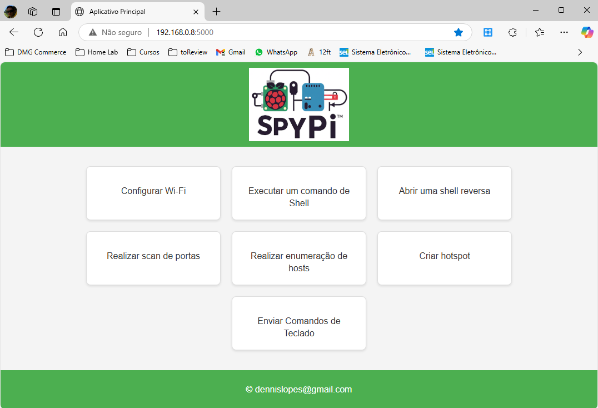
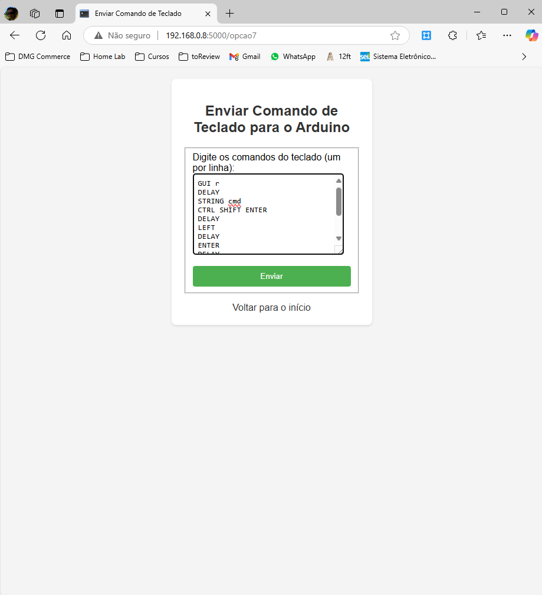
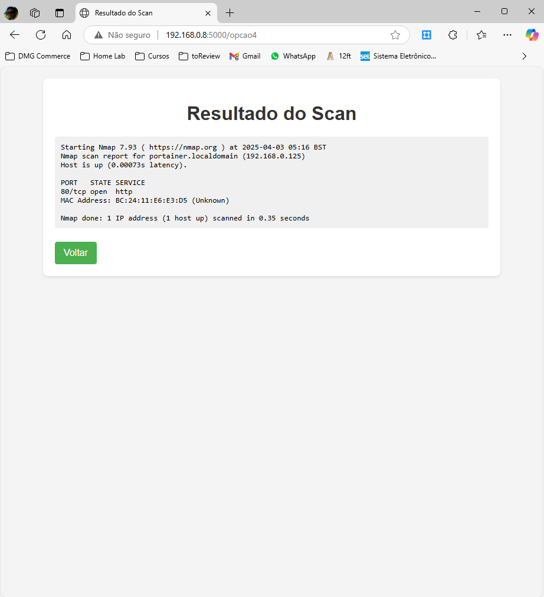

!(SpyPi.png)

# SpyPi - Documentação do Projeto

## Visão Geral
SpyPi é uma interface baseada em Flask para executar comandos de rede e automação em um Raspberry Pi ou Arduino Pro Micro. O sistema permite configurações de Wi-Fi, execução de comandos remotos, análise de rede, e envio de comandos de teclado simulando um Rubber Ducky.

## Funcionalidades

### 1. Configurar Wi-Fi
Permite configurar a conexão sem fio no dispositivo, possibilitando a conexão com diferentes redes Wi-Fi via interface gráfica.

### 2. Executar um Comando de Shell
Permite a execução de comandos no terminal diretamente da interface web. Os comandos são processados pelo shell do sistema operacional e retornam a saída para o usuário.

### 3. Abrir uma Shell Reversa
Cria uma conexão reversa com um servidor remoto, possibilitando que comandos sejam executados no dispositivo remotamente. Isso pode ser útil para exploração da rede pelo SpyPi.

### 4. Realizar Scan de Portas
Utiliza a ferramenta `nmap` para identificar portas abertas e serviços em hosts na rede local. A interface exibe os resultados da análise, incluindo endereços IP, portas e serviços detectados.

### 5. Realizar Enumeração de Hosts
Executa uma varredura para detectar dispositivos ativos na rede, fornecendo informações sobre endereços IP e MAC.

### 6. Criar Hotspot
Configura um ponto de acesso Wi-Fi no dispositivo, permitindo que outros dispositivos se conectem a ele. Utiliza `nmcli con` para gerenciar a conexão e definir parâmetros como SSID e senha. Útil, caso não haja conexões Ethernet disponíveis no ambiente alvo da exploração.

### 7. Enviar Comandos de Teclado
Permite enviar comandos simulando um teclado via um Arduino Pro Micro configurado como um dispositivo HID. Os comandos seguem a sintaxe do Rubber Ducky, possibilitando a automação de tarefas e execução de scripts automáticos. O suporte aos comandos ainda está limitado, sendo os seguintes comandos suportados:

## Comandos Suportados na Opção de Teclado
A funcionalidade de envio de comandos de teclado permite que o Raspberry Pi envie sequências de teclas para um computador utilizando um Arduino configurado como um dispositivo HID. Atualmente, os seguintes comandos são suportados:

- `STRING <texto>`: Digita o texto especificado caractere por caractere.
- `ENTER`: Pressiona a tecla Enter.
- `GUI r`: Simula a combinação `Windows + R`.
- `CTRL ALT DEL`: Simula a combinação `Ctrl + Alt + Del`.
- `CTRL SHIFT ENTER`: Simula a combinação `Ctrl + Shift + Enter`.
- `LEFT`: Pressiona a seta para a esquerda.
- `ALT F4`: Simula a combinação `Alt + F4`.
- `DELAY <tempo>`: Aguarda o tempo especificado (em milissegundos) antes de continuar a execução dos comandos.

## Exemplo de Uso
Para enviar um conjunto de comandos ao Arduino, envie uma sequência como esta:
```
GUI r
DELAY 500
STRING cmd
CTRL SHIFT ENTER
DELAY 500
STRING ipconfig /all
ENTER
ALT F4
```
Isso abrirá o `Executar`, digitará `cmd`, abrirá o terminal com privilégios administrativos, executará `ipconfig /all` e fechará a janela.


## Conexão entre Dispositivos

### Raspberry Pi - UART
O Raspberry Pi pode ser conectado a outro dispositivo (como um Arduino) via UART pelos pinos GPIO. A conexão é feita da seguinte forma:
- **TX (Raspberry Pi) -> RX (Arduino)**
- **RX (Raspberry Pi) -> TX (Arduino)**
- **GND -> GND**

Para configurar a comunicação, utilize:
```bash
sudo raspi-config  # Habilitar a UART
sudo systemctl disable serial-getty@ttyS0.service
sudo systemctl stop serial-getty@ttyS0.service
```
No Python, a comunicação pode ser feita com a biblioteca `pyserial`:
```python
import serial
ser = serial.Serial('/dev/serial0', 115200, timeout=1)
ser.write(b'Hello UART!\n')
ser.close()
```

## Capturas de Tela
Abaixo estão algumas capturas de tela da interface do SpyPi:

### Tela Inicial


### Envio de Comandos de Teclado


### Resultado do Scan de Portas


## Contato
Desenvolvido por **dennislopes@gmail.com**

